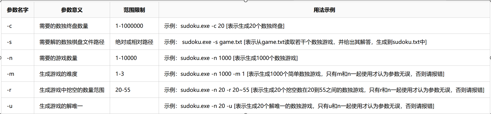

# NKU2023软件工程

> 此作业为南开大学2023软件工程结队编程作业
>
> 小组成员：雷贺奥 郑向鹏

## 作业要求

## Example

输入：

~~~
$ $ $ $ 8 $ $ $ $
$ $ 3 $ $ $ $ 6 4
1 $ $ 6 $ $ 5 $ 7
$ $ $ $ $ 5 4 7 $
$ 9 $ $ 1 $ $ $ $
$ $ 1 $ $ $ 2 $ $
$ $ 9 $ $ 4 $ 5 8
$ 4 $ $ $ 2 9 $ $
7 $ $ $ $ $ 1 $ $
~~~

输出：

~~~
6 2 5 4 8 7 3 1 9
9 7 3 5 2 1 8 6 4
1 8 4 6 3 9 5 2 7
3 6 2 8 9 5 4 7 1
4 9 7 2 1 3 6 8 5
8 5 1 7 4 6 2 9 3
2 1 9 3 6 4 7 5 8
5 4 8 1 7 2 9 3 6
7 3 6 9 5 8 1 4 2
~~~

## 多解数独example

输入

~~~
1 7 5 8 3 9 4 2 6
$ 3 $ 2 7 4 9 1 5
4 2 9 6 5 1 3 7 8
$ 1 $ 3 9 5 7 4 2
5 4 7 1 6 2 8 3 9
2 9 3 4 8 7 6 5 1
7 5 4 9 2 6 1 8 3
9 8 1 5 4 3 2 6 7
3 6 2 7 1 8 5 9 4
~~~

解如下：

~~~
1 7 5 8 3 9 4 2 6
6 3 8 2 7 4 9 1 5
4 2 9 6 5 1 3 7 8
8 1 6 3 9 5 7 4 2
5 4 7 1 6 2 8 3 9
2 9 3 4 8 7 6 5 1
7 5 4 9 2 6 1 8 3
9 8 1 5 4 3 2 6 7
3 6 2 7 1 8 5 9 4

1 7 5 8 3 9 4 2 6
8 3 6 2 7 4 9 1 5
4 2 9 6 5 1 3 7 8
6 1 8 3 9 5 7 4 2
5 4 7 1 6 2 8 3 9
2 9 3 4 8 7 6 5 1
7 5 4 9 2 6 1 8 3
9 8 1 5 4 3 2 6 7
3 6 2 7 1 8 5 9 4
~~~

**处理多解问题，减少blank**

~~~
题目变为：
1 7 5 8 3 9 4 2 6
6 3 $ 2 7 4 9 1 5
4 2 9 6 5 1 3 7 8
$ 1 $ 3 9 5 7 4 2
5 4 7 1 6 2 8 3 9
2 9 3 4 8 7 6 5 1
7 5 4 9 2 6 1 8 3
9 8 1 5 4 3 2 6 7
3 6 2 7 1 8 5 9 4
答案如下：
1 7 5 8 3 9 4 2 6
6 3 8 2 7 4 9 1 5
4 2 9 6 5 1 3 7 8
8 1 6 3 9 5 7 4 2
5 4 7 1 6 2 8 3 9
2 9 3 4 8 7 6 5 1
7 5 4 9 2 6 1 8 3
9 8 1 5 4 3 2 6 7
3 6 2 7 1 8 5 9 4
~~~

